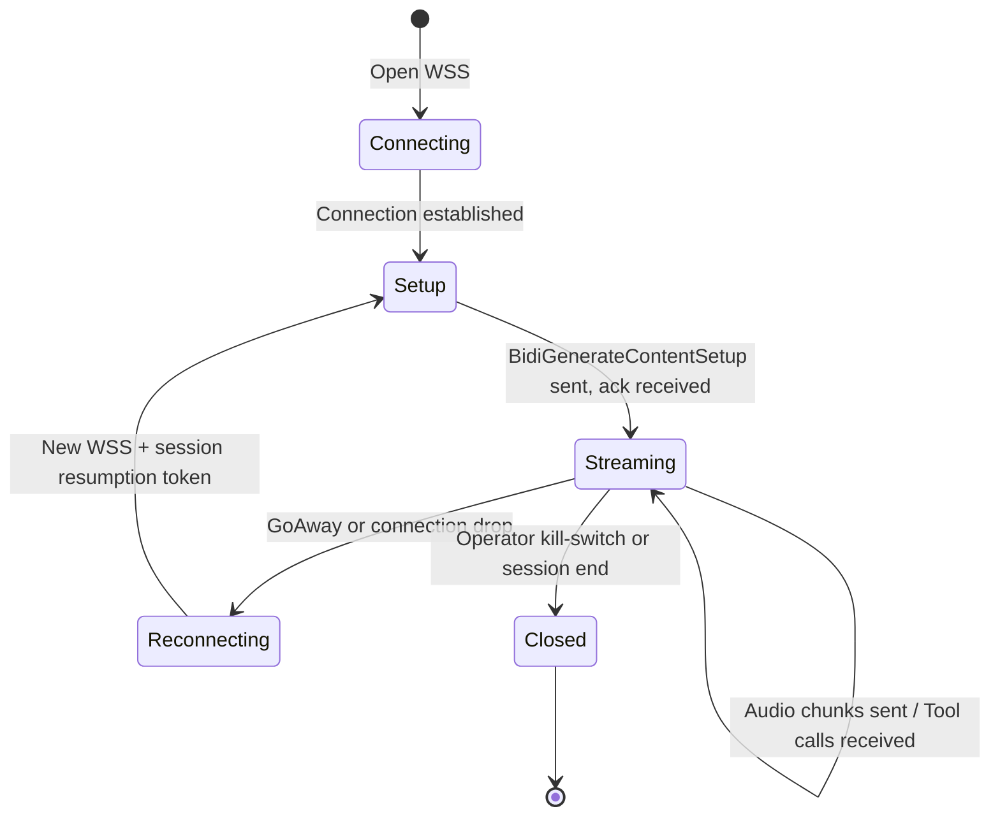
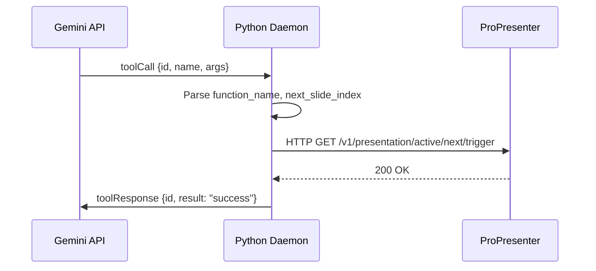

# Phase 2: Gemini Multimodal Live API — WebSocket Integration

> **Goal:** Establish and maintain a persistent, stateful WebSocket connection to the Gemini Live API, stream encoded audio, and receive tool-call responses.

---

## 1. Scope

| In Scope | Out of Scope |
|----------|-------------|
| WSS connection lifecycle management | Prompt/manuscript design (Phase 3) |
| Session setup payload (`BidiGenerateContentSetup`) | ProPresenter HTTP calls (Phase 4) |
| Audio streaming (Base64 → JSON → WSS) | Full orchestration / TaskGroup (Phase 5) |
| Tool-call reception and acknowledgment | |
| Context window compression configuration | |
| Session resumption (`GoAway` handling) | |

---

## 2. Connection Architecture

### 2.1 Endpoint

```
wss://generativelanguage.googleapis.com/ws/google.ai.generativelanguage.v1beta.GenerativeService.BidiGenerateContent
```

Authentication is via query parameter: `?key={API_KEY}`

For enterprise deployments, use the `v1alpha` endpoint with ephemeral tokens via a backend proxy to avoid exposing API keys.

### 2.2 Connection Lifecycle



---

## 3. Session Setup Payload

The first message after connection must be the `BidiGenerateContentSetup` object. No audio can be sent before this is acknowledged.

```json
{
  "setup": {
    "model": "models/gemini-2.5-flash-native-audio",
    "generationConfig": {
      "responseModalities": ["TEXT"],
      "temperature": 0.0
    },
    "systemInstruction": {
      "parts": [
        {
          "text": "<<SYSTEM_PROMPT + MANUSCRIPT — see Phase 3>>"
        }
      ]
    },
    "tools": [
      {
        "functionDeclarations": [
          {
            "name": "trigger_presentation_slide",
            "description": "Advance the live presentation to the specified slide index. Call this when the speaker has semantically completed the content of the current slide block and is transitioning to the next.",
            "parameters": {
              "type": "OBJECT",
              "properties": {
                "next_slide_index": {
                  "type": "INTEGER",
                  "description": "The 0-based index of the slide to display next."
                }
              },
              "required": ["next_slide_index"]
            }
          }
        ]
      }
    ],
    "realtimeInputConfig": {
      "mediaResolution": "MEDIA_RESOLUTION_LOW"
    },
    "contextWindowCompression": {
      "slidingWindow": {
        "targetTokens": 100000
      }
    },
    "sessionResumption": {
      "handle": null
    }
  }
}
```

### 3.1 Key Configuration Decisions

| Field | Value | Rationale |
|-------|-------|-----------|
| `model` | `gemini-2.5-flash-native-audio` | Native audio processing — no intermediate STT step |
| `responseModalities` | `["TEXT"]` | Suppress audio generation; model should only emit tool calls |
| `temperature` | `0.0` | Deterministic output — we want consistent, predictable tool calls |
| `contextWindowCompression` | 100K target tokens | Enables sessions beyond the 15-minute uncompressed limit |
| `mediaResolution` | `LOW` | Minimizes token consumption for audio; speech doesn't need high fidelity |

---

## 4. Audio Streaming Protocol

### 4.1 Egress Message Format

Each audio chunk from Phase 1's queue is transmitted as:

```json
{
  "realtimeInput": {
    "mediaChunks": [
      {
        "mimeType": "audio/pcm;rate=16000",
        "data": "<<BASE64_ENCODED_PCM_BYTES>>"
      }
    ]
  }
}
```

### 4.2 Encoding Pipeline

```
Raw PCM bytes (1024 bytes)
    │
    ▼
base64.b64encode(pcm_bytes).decode('ascii')
    │
    ▼
JSON serialization (realtimeInput envelope)
    │
    ▼
websocket.send(json_string)
```

### 4.3 Streaming Cadence

- Chunks arrive from `audio_queue` every ~32ms
- Each JSON message is ~1.5 KB after Base64 encoding
- Sustained bandwidth: ~47 KB/s upstream (well within typical broadband)

---

## 5. Receiving and Processing Server Messages

### 5.1 Message Types

The server sends several message types. The daemon must handle all of them.

| Message Type | Key Field | Action |
|-------------|-----------|--------|
| **Setup Complete** | `setupComplete` | Transition to streaming state |
| **Server Content** | `serverContent.modelTurn.parts[].text` | Log any text responses (should be rare given prompt) |
| **Tool Call** | `toolCall.functionCalls[]` | Extract function name, args, and unique `id` → execute locally |
| **Go Away** | `goAway.timeLeft` | Cache session resumption handle, prepare to reconnect |
| **Session Resumption Update** | `sessionResumptionUpdate.newHandle` | Store updated handle for future reconnections |
| **Interrupted** | `interrupted` | Model was interrupted; may require state reconciliation |

### 5.2 Tool Call Processing Flow



### 5.3 Tool Response Acknowledgment

After executing the local action, the daemon **must** send a tool response back:

```json
{
  "toolResponse": {
    "functionResponses": [
      {
        "id": "<<UNIQUE_CALL_ID_FROM_SERVER>>",
        "name": "trigger_presentation_slide",
        "response": {
          "result": "success",
          "slide_index": 1
        }
      }
    ]
  }
}
```

> [!CAUTION]
> **Failure to return the `toolResponse` will stall the Gemini session.** The model waits indefinitely for confirmation before continuing semantic tracking.

---

## 6. Context Window Compression

### 6.1 Problem

Uncompressed audio sessions are terminated after **15 minutes**. Sermons commonly run 30–60 minutes.

### 6.2 Solution

The `contextWindowCompression` configuration with `slidingWindow` enables the server to:
1. Continuously discard the oldest processed audio tokens
2. Preserve the system prompt and manuscript text
3. Retain recent acoustic context for continuity

**Target tokens: 100,000** — provides a comfortable buffer while allowing session durations well beyond 60 minutes.

### 6.3 Token Budget Estimate

| Content | Approx. Token Cost |
|---------|-------------------|
| System prompt + manuscript (5,000 words) | ~7,500 tokens |
| Audio context (rolling window) | Up to ~92,500 tokens |
| **Total** | **~100,000 tokens** |

---

## 7. Session Resumption Protocol

### 7.1 `GoAway` Handling

```python
async def handle_go_away(message, state):
    """Server is about to close the connection."""
    time_left = message.get("goAway", {}).get("timeLeft")
    log.warning(f"GoAway received. Time remaining: {time_left}")

    # Use the latest cached resumption handle
    state.reconnect_needed = True
```

### 7.2 Resumption Handle Management

- On every `sessionResumptionUpdate` message, cache the `newHandle`
- On reconnection, pass the handle in the setup payload:

```json
{
  "setup": {
    "sessionResumption": {
      "handle": "<<CACHED_HANDLE>>"
    }
  }
}
```

This allows the model to restore its internal semantic tracking state without reprocessing the entire manuscript or replaying audio history.

---

## 8. Module Design

### 8.1 Module: `gemini_session.py`

```
gemini_session.py
├── GeminiConfig (dataclass)
│   ├── api_key: str
│   ├── model: str = "models/gemini-2.5-flash-native-audio"
│   ├── endpoint: str = "wss://generativelanguage.googleapis.com/ws/..."
│   ├── target_tokens: int = 100000
│   └── reconnect_max_backoff_s: float = 8.0
│
├── GeminiSession (class)
│   ├── __init__(config, audio_queue, tool_handler)
│   ├── connect() -> None
│   ├── disconnect() -> None
│   ├── send_setup(system_prompt, tools) -> None
│   ├── _stream_audio() -> None          # Egress coroutine
│   ├── _receive_messages() -> None      # Ingress coroutine
│   ├── _handle_tool_call(msg) -> None
│   ├── _handle_go_away(msg) -> None
│   ├── _reconnect() -> None             # Exponential backoff + session resume
│   └── _send_tool_response(call_id, result) -> None
│
└── ToolHandler (Protocol)
    └── handle(name: str, args: dict) -> dict
        # Implemented by ProPresenter controller (Phase 4)
```

---

## 9. Error Handling

| Failure Mode | Detection | Recovery |
|-------------|-----------|----------|
| WSS connection refused | `ConnectionRefusedError` | Exponential backoff retry (1s → 2s → 4s → 8s max) |
| WSS connection dropped mid-stream | `ConnectionClosedError` | Reconnect with session resumption handle |
| `GoAway` received | Server message | Graceful reconnect using cached handle |
| Invalid API key | `403` or error in setup response | Log error, halt — requires operator intervention |
| Tool response timeout | Internal timer (5s) | Log warning, send error response to unblock model |
| Malformed server message | JSON parse error | Log and skip message; continue listening |

---

## 10. Testing Strategy

### 10.1 Unit Tests

- **`test_setup_payload_construction`** — Verify JSON schema matches API spec
- **`test_audio_encoding`** — Confirm Base64 encoding of PCM chunks
- **`test_tool_call_parsing`** — Parse sample tool-call message, extract id/name/args
- **`test_tool_response_format`** — Validate response JSON structure
- **`test_go_away_handling`** — Verify state transition to reconnecting

### 10.2 Integration Tests

- **`test_connect_and_setup`** — Connect to real API (or mock WSS server), send setup, receive ack
- **`test_stream_and_receive`** — Send 10 seconds of audio, verify no errors
- **`test_reconnection`** — Simulate connection drop, verify reconnect with handle

---

## 11. Deliverables

- [ ] `seeker/gemini_session.py` — WebSocket session manager
- [ ] `seeker/config.py` — Configuration loader (Gemini section)
- [ ] `tests/test_gemini_session.py` — Unit + integration tests
- [ ] Mock WSS server for offline testing

---

## 12. Dependencies

| Dependency | Direction | Detail |
|-----------|-----------|--------|
| Phase 1 (Audio) | **Upstream producer** | Consumes audio chunks from `audio_queue` |
| Phase 3 (Prompt) | **Content** | System prompt and manuscript injected at setup |
| Phase 4 (ProPresenter) | **Tool handler** | Tool calls dispatched to ProPresenter controller |
| Phase 5 (Orchestration) | **Lifecycle** | Connection managed by the main TaskGroup |
