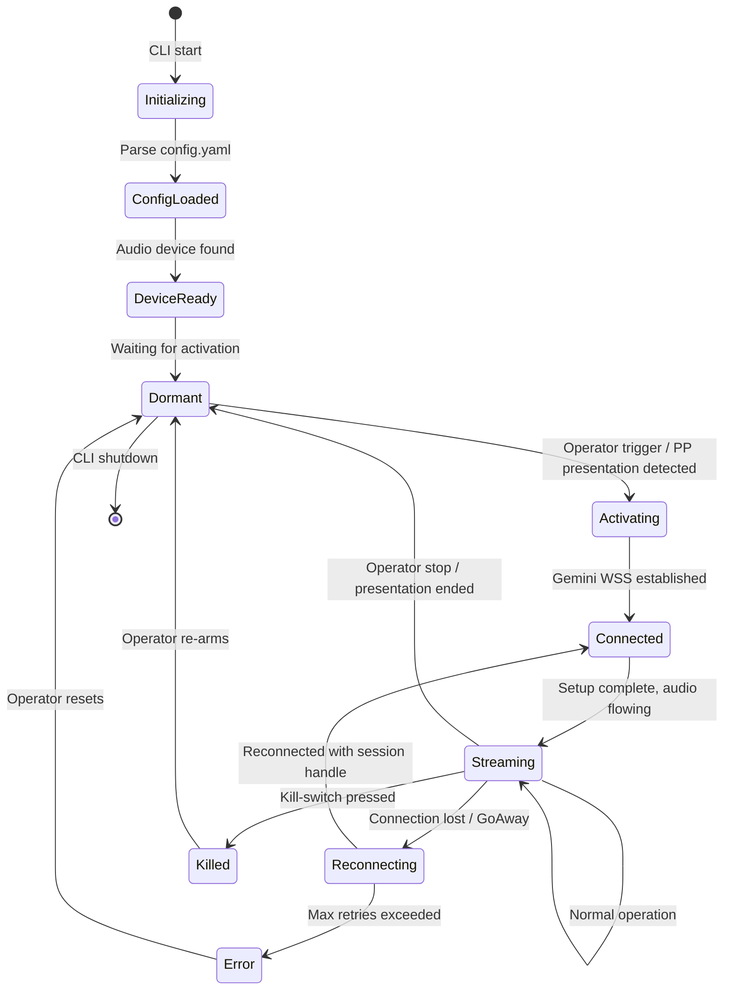

# Phase 5: Reliability, Orchestration & Operator UX

> **Goal:** Wire all subsystems together with robust concurrency, lifecycle management, fault tolerance, and operator controls — producing a production-ready daemon.

---

## 1. Scope

| In Scope | Out of Scope |
|----------|-------------|
| `asyncio.TaskGroup` orchestration of all subsystems | Core subsystem internals (Phases 1–4) |
| Error propagation and recovery coordination | Prompt tuning content (Phase 3) |
| Exponential backoff reconnection logic | |
| Operator kill-switch and status endpoints | |
| Pre-service dormancy / auto-activation | |
| Latency monitoring and logging | |
| CLI entrypoint and startup sequence | |

---

## 2. Concurrency Architecture

### 2.1 Task Group Topology

The daemon runs three primary concurrent tasks within an `asyncio.TaskGroup`:

```
┌──────────────────────────────────────────────────────────────────────┐
│  asyncio.TaskGroup                                                   │
│                                                                      │
│  ┌──────────────────┐  ┌──────────────────┐  ┌────────────────────┐ │
│  │ T1: Audio        │  │ T2: WebSocket    │  │ T3: Orchestration  │ │
│  │    Ingestion     │  │    Egress        │  │    & Reception     │ │
│  │                  │  │                  │  │                    │ │
│  │ • PyAudio read   │  │ • Await queue    │  │ • Listen WSS       │ │
│  │   (in thread)    │──▶ • Base64 encode  │  │ • Parse tool calls │ │
│  │ • Queue push     │  │ • WSS send       │  │ • Dispatch to PP   │ │
│  └──────────────────┘  └──────────────────┘  │ • Send tool resp   │ │
│          │                       │            └────────────────────┘ │
│          │                       │                      │            │
│          └───── audio_queue ─────┘                      │            │
│                                                         │            │
│  ┌──────────────────────────────────────────────────────┘           │
│  │                                                                   │
│  │  ┌──────────────────┐  ┌──────────────────┐                      │
│  │  │ T4: Operator     │  │ T5: Health       │                      │
│  │  │    HTTP Server   │  │    Monitor       │                      │
│  │  │                  │  │                  │                      │
│  │  │ • Kill-switch    │  │ • PP heartbeat   │                      │
│  │  │ • Status API     │  │ • Latency stats  │                      │
│  │  │ • Manual trigger │  │ • Queue depth    │                      │
│  │  └──────────────────┘  └──────────────────┘                      │
│                                                                      │
└──────────────────────────────────────────────────────────────────────┘
```

### 2.2 Task Responsibilities

| Task | Blocking? | Thread Model | Primary I/O |
|------|-----------|-------------|-------------|
| **T1: Audio Ingestion** | Yes (hardware read) | `asyncio.to_thread()` executor | PyAudio → Queue |
| **T2: WebSocket Egress** | No | Main event loop | Queue → WSS |
| **T3: Orchestration/Reception** | No | Main event loop | WSS → HTTP (to PP) |
| **T4: Operator HTTP Server** | No | Main event loop | HTTP server (inbound) |
| **T5: Health Monitor** | No | Main event loop | Timer-driven checks |

---

## 3. Application Lifecycle

### 3.1 State Machine



### 3.2 Startup Sequence

```
1. Parse CLI arguments and load config.yaml
2. Validate configuration (API key, audio device, PP connectivity)
3. Start operator HTTP server (T4)
4. Start health monitor (T5)
5. Enter DORMANT state
6. Await activation signal:
   a. Operator presses "Start" on Stream Deck  — OR —
   b. ProPresenter WS subscription detects sermon UUID → ACTIVE
7. Launch audio capture (T1)
8. Establish Gemini WSS connection (T2 + T3)
9. Send BidiGenerateContentSetup with manuscript
10. Enter STREAMING state — begin processing
```

### 3.3 Shutdown Sequence

```
1. Stop audio capture (close PyAudio stream)
2. Send close frame on Gemini WSS
3. Cancel pending tasks in TaskGroup
4. Log session summary (slides triggered, errors, duration)
5. Return to DORMANT state (or exit if CLI shutdown)
```

---

## 4. Pre-Service Dormancy & Auto-Activation

### 4.1 Problem

Before the sermon starts, ProPresenter runs countdown timers, announcement loops, and worship lyrics. Starting the Gemini session during this time:

- Wastes API tokens processing irrelevant audio
- Risks spurious slide triggers from ambient conversation

### 4.2 Solution: ProPresenter WebSocket Monitoring

The daemon subscribes to ProPresenter's WebSocket API to monitor the active presentation:

```python
async def monitor_propresenter_state(config, activation_callback):
    """Watch for the sermon presentation to become ACTIVE."""
    ws_url = f"ws://{config.host}:{config.port}/remote"
    async with websockets.connect(ws_url) as ws:
        # Authenticate
        await ws.send(json.dumps({
            "action": "authenticate",
            "protocol": "701",
            "password": base64.b64encode(config.password.encode()).decode()
        }))

        while True:
            msg = json.loads(await ws.recv())
            if msg.get("action") == "presentationCurrent":
                if msg["presentation"]["uuid"] == config.sermon_uuid:
                    await activation_callback()
                    return
```

### 4.3 Manual Activation

Alternatively, the operator triggers activation via:

- **Stream Deck button** → HTTP POST to `/api/activate`
- **CLI command** → `seeker start --manuscript sermon.txt`

---

## 5. Operator Control Endpoints

### 5.1 HTTP API (local only)

The daemon exposes a lightweight HTTP server on `localhost:8080` (configurable):

| Endpoint | Method | Action |
|----------|--------|--------|
| `/api/status` | `GET` | Returns daemon state, current slide, latency stats |
| `/api/activate` | `POST` | Activates streaming (exits dormancy) |
| `/api/deactivate` | `POST` | Gracefully stops streaming, returns to dormancy |
| `/api/kill` | `POST` | **Emergency kill-switch** — immediately severs Gemini connection |
| `/api/health` | `GET` | Liveness probe (for external monitoring) |

### 5.2 Status Response Schema

```json
{
  "state": "streaming",
  "current_slide_index": 7,
  "total_slides": 24,
  "session_duration_s": 842,
  "gemini_connected": true,
  "propresenter_connected": true,
  "audio_queue_depth": 3,
  "last_trigger_latency_ms": 487,
  "avg_trigger_latency_ms": 512,
  "errors_count": 0
}
```

### 5.3 Kill-Switch Behavior

When `/api/kill` is invoked:

1. Immediately close the Gemini WebSocket (no graceful shutdown)
2. Stop audio capture
3. **Do NOT send any commands to ProPresenter** — leave it in its current state
4. Log the kill event with timestamp
5. Transition to `KILLED` state

The operator can then resume manual slide control via ProPresenter's normal UI. To re-arm the daemon, they hit `/api/activate`.

### 5.4 Stream Deck / Companion Integration

Bitfocus Companion can be configured with HTTP triggers:

| Button | Companion Action | Daemon Endpoint |
|--------|-----------------|-----------------|
| 🟢 **Start** | HTTP POST | `http://localhost:8080/api/activate` |
| 🔴 **Kill** | HTTP POST | `http://localhost:8080/api/kill` |
| 🟡 **Status** | HTTP GET | `http://localhost:8080/api/status` |

---

## 6. Fault Tolerance

### 6.1 Reconnection Strategy

All reconnection attempts use exponential backoff with jitter:

```python
async def reconnect_with_backoff(connect_fn, max_backoff=8.0):
    attempt = 0
    while True:
        try:
            await connect_fn()
            return  # Success
        except (ConnectionError, TimeoutError) as e:
            delay = min(2 ** attempt + random.uniform(0, 1), max_backoff)
            log.warning(f"Reconnect attempt {attempt+1} failed: {e}. Retrying in {delay:.1f}s")
            await asyncio.sleep(delay)
            attempt += 1
```

### 6.2 Failure Matrix

| Component | Failure | Impact | Recovery |
|-----------|---------|--------|----------|
| **Audio device** | Disconnect | No audio to send | Retry device open; operator alerted |
| **Gemini WSS** | Connection drop | No tool calls | Reconnect with session resumption handle |
| **Gemini WSS** | `GoAway` received | Planned disconnect | Graceful reconnect using cached handle |
| **Gemini API** | Rate limit / 429 | Temporary outage | Backoff retry; audio queue buffers ~3s |
| **ProPresenter** | API unreachable | Slides don't advance | Log warning; operator takes manual control |
| **ProPresenter** | Wrong presentation active | Wrong slides triggered | Halt and alert operator |
| **Internet** | Complete outage | Gemini unreachable | Audio queue fills, drops oldest; dormant until restored |

### 6.3 Error Escalation

```
Level 1 (Auto-recover):  Transient network errors, single failed HTTP call
Level 2 (Log + retry):   Multiple consecutive failures, queue overflow
Level 3 (Alert operator): Device disconnect, ProPresenter unreachable for >30s
Level 4 (Auto-kill):      Gemini session irrecoverable, audio device permanently lost
```

---

## 7. Latency Monitoring

### 7.1 Measurement Points

```
t0: Audio chunk captured from hardware
t1: Chunk transmitted over WSS
t2: Tool call received from Gemini
t3: HTTP trigger sent to ProPresenter
t4: HTTP response received from ProPresenter
```

### 7.2 Latency Budget (Target: < 1000ms end-to-end)

| Stage | Metric | Target |
|-------|--------|--------|
| Audio capture | `t1 - t0` | < 64ms |
| Network egress | WSS send | < 50ms |
| AI inference | `t2 - t1` | < 500ms |
| Network ingress | Tool call receive | < 50ms |
| Local execution | `t4 - t3` | < 15ms |
| **Total** | `t4 - t0` | **< 700ms** |

### 7.3 Logging

All latency measurements are logged and exposed via the `/api/status` endpoint. A rolling average and max are tracked for the current session.

---

## 8. Configuration (Full)

```yaml
# config.yaml — complete configuration file

audio:
  device_name: "Focusrite USB"
  device_index: null
  sample_rate: 16000
  channels: 1
  chunk_duration_ms: 32
  queue_max_size: 100

gemini:
  api_key: "${GEMINI_API_KEY}"       # Environment variable reference
  model: "models/gemini-2.5-flash-native-audio"
  target_tokens: 100000
  reconnect_max_backoff_s: 8.0

propresenter:
  host: "127.0.0.1"
  port: 50001
  protocol: "http"
  timeout_s: 2.0
  use_sequential_trigger: true
  health_check_interval_s: 30
  # Optional: WebSocket monitoring
  ws_password: ""
  sermon_uuid: ""                    # UUID of the sermon presentation for auto-activation

operator:
  http_port: 8080
  http_host: "127.0.0.1"            # Localhost only for security

logging:
  level: "INFO"
  file: "seeker.log"
  console: true
  latency_tracking: true

prompt:
  template: "prompts/active.txt"
  manuscript: ""                     # Path to manuscript file; set at runtime
```

---

## 9. CLI Interface

### 9.1 Module: `cli.py`

```
Usage: seeker [OPTIONS] COMMAND [ARGS]

Commands:
  start        Start the daemon with a manuscript
  devices      List available audio devices
  test-audio   Capture and playback a short audio clip
  test-pp      Test ProPresenter connectivity
  version      Show version information

Options:
  --config PATH    Path to config.yaml (default: ./config.yaml)
  --verbose        Enable debug logging
```

### 9.2 Example Usage

```bash
# List audio devices
seeker devices

# Test ProPresenter connection
seeker test-pp

# Start with a manuscript (manual activation via Stream Deck)
seeker start --manuscript sermon.txt

# Start with auto-activation (waits for PP sermon UUID)
seeker start --manuscript sermon.txt --auto-activate
```

---

## 10. Module Design

### 10.1 Module: `daemon.py`

```
daemon.py
├── SeekerDaemon (class)
│   ├── __init__(config)
│   ├── start() -> None              # Main entrypoint
│   ├── stop() -> None               # Graceful shutdown
│   ├── kill() -> None               # Emergency stop
│   ├── _run_task_group() -> None    # asyncio.TaskGroup orchestration
│   ├── _on_activate() -> None       # Transition: Dormant → Streaming
│   ├── _on_deactivate() -> None     # Transition: Streaming → Dormant
│   └── state -> DaemonState         # Current lifecycle state
│
├── DaemonState (enum)
│   ├── INITIALIZING
│   ├── DORMANT
│   ├── ACTIVATING
│   ├── STREAMING
│   ├── RECONNECTING
│   ├── ERROR
│   └── KILLED
│
└── OperatorServer (class)
    ├── __init__(daemon, config)
    ├── start() -> None
    └── Routes: /api/status, /api/activate, /api/deactivate, /api/kill, /api/health
```

---

## 11. Testing Strategy

### 11.1 Unit Tests

- **`test_daemon_lifecycle`** — Verify state transitions: DORMANT → STREAMING → DORMANT
- **`test_kill_switch`** — Verify immediate teardown without ProPresenter commands
- **`test_backoff_timing`** — Verify exponential backoff with jitter
- **`test_operator_endpoints`** — HTTP endpoint responses and side effects

### 11.2 Integration Tests

- **`test_full_pipeline_mock`** — Mock audio source + mock Gemini WSS + mock ProPresenter
  - Send simulated audio, verify tool calls arrive, verify PP triggers fire
- **`test_reconnection_flow`** — Simulate GoAway, verify session resumption
- **`test_queue_backpressure`** — Simulate slow network, verify queue drops oldest

### 11.3 End-to-End Acceptance

- [ ] Deploy with physical audio feed + real Gemini API + real ProPresenter
- [ ] Run 5-minute test sermon with 10 slide transitions
- [ ] Measure latency for each transition (target: < 1s)
- [ ] Simulate network drop mid-sermon, verify recovery
- [ ] Press kill-switch, verify immediate halt
- [ ] Resume manual control via ProPresenter UI

---

## 12. Deliverables

- [ ] `seeker/daemon.py` — Main daemon orchestrator
- [ ] `seeker/operator_server.py` — Operator HTTP API
- [ ] `seeker/cli.py` — CLI entrypoint
- [ ] `config.example.yaml` — Example configuration file
- [ ] `tests/test_daemon.py` — Lifecycle and integration tests
- [ ] Operator guide: Stream Deck / Companion button mapping

---

## 13. Dependencies

| Dependency | Direction | Detail |
|-----------|-----------|--------|
| Phase 1 (Audio) | **Contains** | Audio capture task runs within TaskGroup |
| Phase 2 (Gemini) | **Contains** | Gemini session managed within TaskGroup |
| Phase 3 (Prompt) | **Loads** | Manuscript + prompt template loaded at activation |
| Phase 4 (ProPresenter) | **Contains** | PP client lifecycle managed; health checks run continuously |
